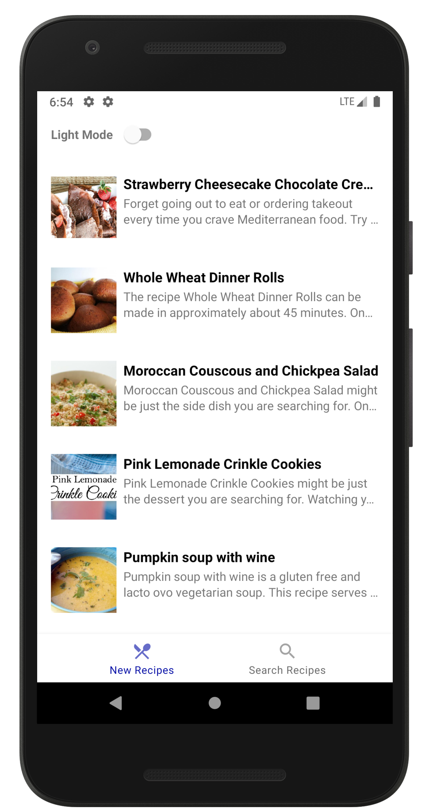
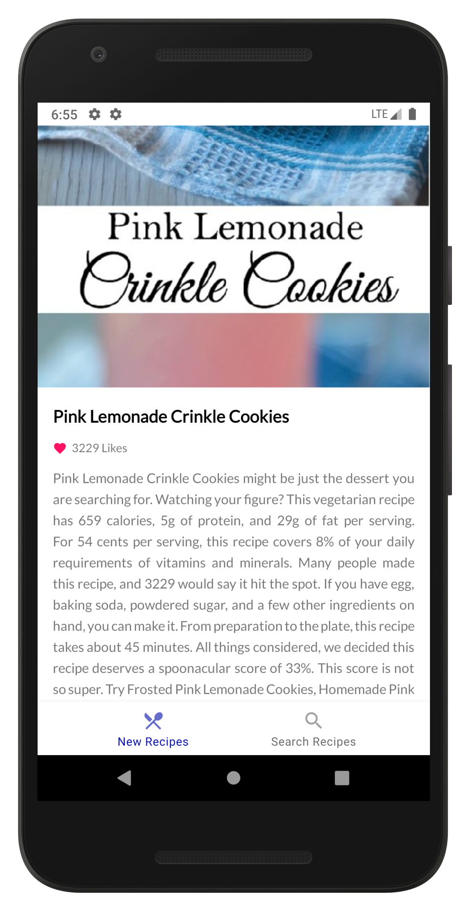
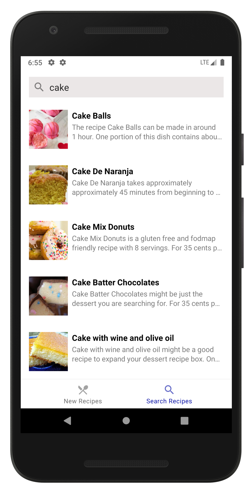
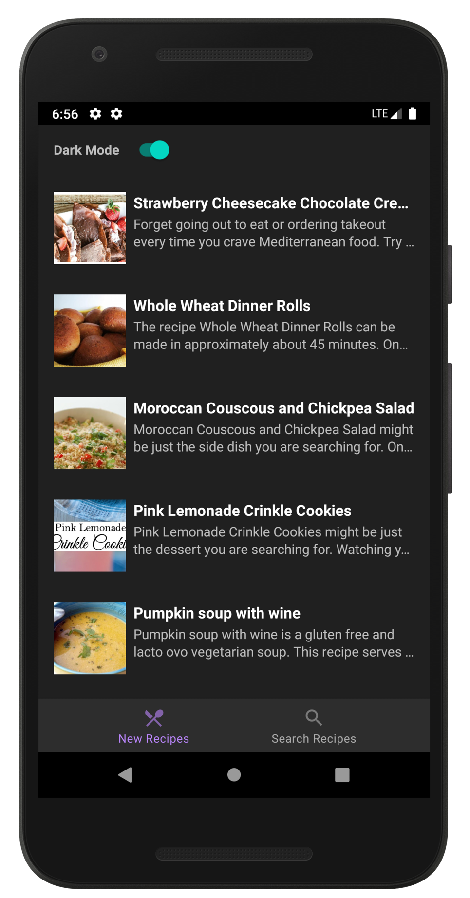
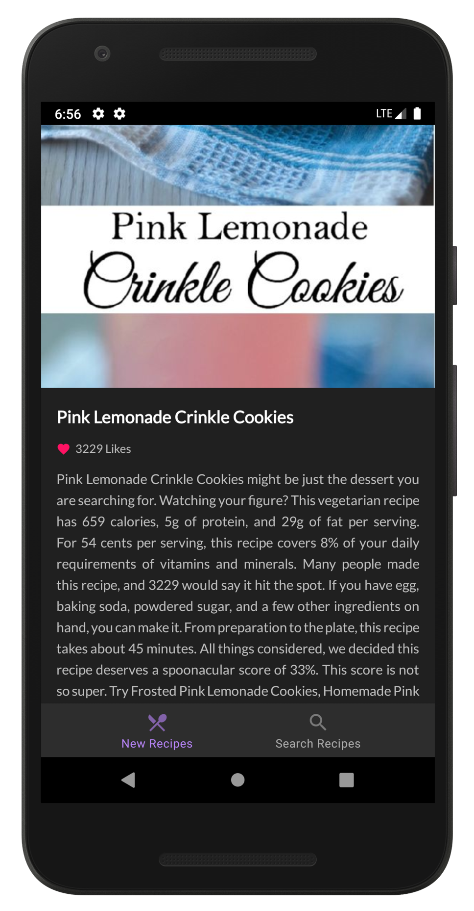
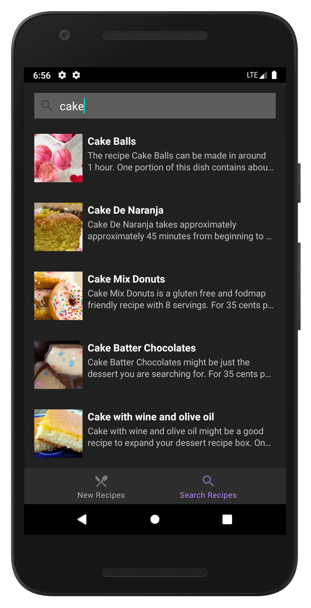

# RecipeApp

RecipeApp is an android app for browsing and searching recipes of your choice. The app uses **Retrofit** library along with MVVM(Model View ViewModel) architecture pattern to fetch the recipes data from an API source.

## Steps to run

- Download or clone the repository.
- Get an API Key from [here](https://spoonacular.com/food-api "Spoonacular Recipe and Food API").
- Go to `Constants.kt` file and replace `API_KEY_HERE` with your API Key.
- Run the project on an emulator or physical device.

## Screenshots

  
   
  

## Dark Mode

  
   
  

## License

This project is currently licensed under the Apache License Version 2.0. A copy of [LICENSE](LICENSE) should be present along with the source code.
